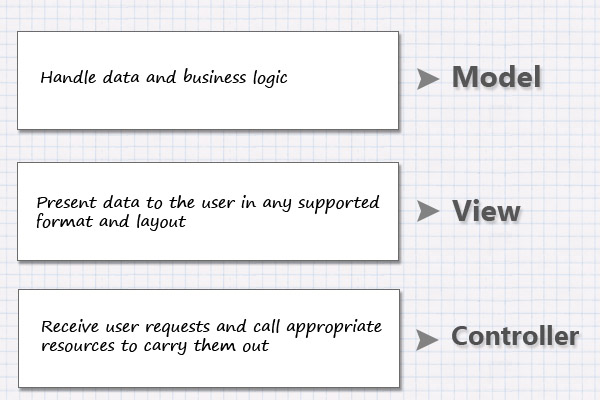
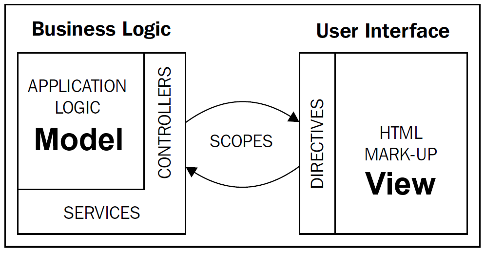

#What is AngularJS?

**AngularJS** is an open-source JavaScript framework, maintained by Google. Its goal is to make both
development and testing of browser-based applications easier.

It is particularly effective for building **Single Page Applications (SPA)** that run in a browser.

Basic HTML is great for **displaying static documents**, but is not so good at describing the
**dynamic views** needed for interactive applications. A key strength of AngularJS is that it was
built from the start to encourage **good software engineering practices** and **build on what
browsers do well**.

- **HTML Templates** - Use everyday **HTML and CSS** to design the look of your application.
- **Data-binding** - Bind data to the HTML view, so that it **updates automatically** when
  the data changes.
- **Extend HTML** - Use pre-built "directives" to **extend HTML** with new elements and
  attributes that suit your application.
- **Application structure** - Separate application logic (**JavaScript code**) from the visual
  presentation (**HTML + CSS**) of the data to the user.

This separation of logic from views, is often called **MVC** (see below):

- **Developers** focus on building and testing the business logic (in JavaScript) independent of the
  final presentation to the user.
- **Designers** can create and test views (in HTML/CSS) without worrying about how the business
  logic will be implemented.
 
#Model View Controller (MVC)

>**MVC is not a design pattern, it is an Architectural Pattern that describes a way to structure our
application and the responsibilities and interactions for each part in that structure.**

The idea behind MVC is simple. We must have the following responsibilities clearly separated in our
application:

In the AngularJS form of MVC, there is also the concept of a **ViewModel**, called the **Scope**,
which is an aspect of the business **Model** that is made available to the **View**.

##Model

The **Model** is **the data and the rules** applying to that data, which represent objects that the
application uses. Some of these objects hold the **business data**, such as `User` or
`ShoppingCart`, and some objects provide services that represent the **business logic**, such as an
`Inventory` or `Security` service. Here are some examples of Model objects for a shopping
application:

- **User** - containing **name** and **address**.
- **Inventory** - providing **getStockQuantity** or **findByColour**
- **ShoppingCart** - containing **items** and **quantity**
- **EmailNotification** - containing **emailAddress**, **subject** and **body**
- **Security** - providing **login** or **resetPassword**

In an AngularJS application the Model is represented by **JavaScript objects**.  The data is held in
**properties**, such as:

- `user.firstName`
- `email.subject`
- `order.transationDate`
- `cart.item.quantity`

The services are defined as **methods**, such as

- `security.login(userName, password)`
- `search.query(searchTerm)`

### Serializing Models

The Model data objects are transmitted over the internet between the **browser** and the **server**
as strings. These strings are usually formatted as JSON or XML.

- **JavaScript Object Notation (JSON)**
  
    `"{ userId: 123, firstName: 'Jo', lastName: 'Bloggs'}"`

- **eXtensible Markup Language (XML)** 
  
    `"<user user-id='123' first-name='Jo' last-name='Bloggs'></user>"`

JSON is the preferred method as it has a direct mapping to JavaScript objects but sometimes you must
connect to a server that only serves XML.

##View

The View provides different ways **to present the data in the model**. In an AngularJS application,
**views are defined as HTML and CSS**. The HTML provides a template, to which AngularJS binds the
data in the Model.  The CSS tells the browser how to visually style the template.

There can be more than one **View** of a single piece of data in the **Model**. For example,
consider displaying **Stock Items** in a shopping application, you could have:

- `stock-list.html` - **a summary of all the items in stock**
- `stock-detail.html` - **the detail of a single item in the stock**.

Both views use data from the same model but display it in very different ways to the user.

##Controller

The Controller **links the view to the model**. Its main function is to expose the **Model** data
and handler functions to the **View**. Usually these **handlers are triggered by user interactions**
such as clicking on a button. A handler will normally call through to an appropriate Model function
to run the actual business logic based on the events from the View.

##Scope (ViewModel)
AngularJS uses an object called a Scope to **expose the data and handlers to the View**.  The
Controller will take data from the Model and attach it, as properties, to the Scope. Once on the
scope, these properties are available for data binding to HTML elements in the View. The Controller
also attaches the event handler functions to the Scope, so that the View can also bind events to
them.

This diagram shows how the different parts of the MVC pattern fit into AngularJS.

#Further Reading
For more information on MVC you can look here:

- [Tuts+](http://net.tutsplus.com/tutorials/other/mvc-for-noobs/)
- [Microsoft](http://msdn.microsoft.com/en-us/library/ff649643.aspx)
- [Ben Nadel](http://www.bennadel.com/blog/2379-A-Better-Understanding-Of-MVC-Model-View-Controller-Thanks-To-Steven-Neiland.htm)